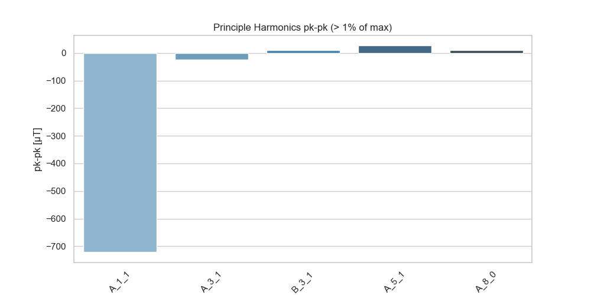

# Spherical Harmonics

## Simple example

Create a new file 'fit_harmonics.py' and copy the below code into it.

Note that although this code looks very long, it is only

```python
from MRI_DistortionQA.FieldAnalysis import SphericalHarmonicFit
import pandas as pd

FieldData = pd.read_csv('Bfields.csv', index_col=0).squeeze("columns")
# load previously saved data

'''
This data contains columns ['x', 'y', 'z', 'B_Gx', 'B_Gy', 'B_Gz']
but the spherical harmonics code expects to receieve [x, y, z, Bz]
therefore, we will need to create a new dataframe with appropriately named columns
for each field we want to fit to:
'''

n_order = 8
# G_x Harmonics
GradXdata = FieldData[['x', 'y', 'z', 'B_Gx']]
GradXdata = GradXdata.rename(columns={"B_Gx": "Bz"})  # spherical harmonics code expects to receieve one field called Bz
G_x_Harmonics = SphericalHarmonicFit(GradXdata, n_order=n_order, r_outer=150)
G_x_Harmonics.harmonics.to_csv('G_x_harmonics.csv')

# some plotting examples
G_x_Harmonics.plot_cut_planes()
G_x_Harmonics.plot_harmonics_pk_pk(cut_off=.01)
G_x_Harmonics.print_key_harmonics(cut_off=.01)
```


**Reconstructed fields in each cardinal plane for the X gradient coil. Note that there is strong variantion in X (as expected) and the field is close to 0 in the ZY plane (as expected)**



**This figure shows the dominant harmonics for the X gradient. If you are a harmonics nerd, you will know that the A11 harmonic corresponds to a perfect X gradient field; therefore it is gratifying to see that this is by far the most strongly expressed harmonic for the X gradient!**

## Explaining the code output:

The code probably printed the following to the screen:

```
[FieldAnalysis.py: line 86  WARNING] input sample points do not appear to cover a full sphere
Initial pk-pk:        693.401 μT
Reconstructed pk-pk:  693.795 μT
Residual pk-pk:       2.023 μT
```

The warning here is telling us that the sample points do not appear to cover a full sphere. We can ignore this in situations where we are confident that we have sufficient sampling of points for the order of harmonics we are fitting. 

- [ ] ToDo: autoamate this check!!

The second part is telling us the peak-to-peak perturbation over the surface of r_outer (150 mm in this case). We would like to see that the reconstructed pk-pk closely matches the input, and that the residual pk-pk is low relative to the total. In this case, the reconstructed pk-pk is within 0.4 μT and the residual is < 1%, so the fit is pretty good!

## Remaining harmonics

Now we have the X-harmonics; we need to do the same thing for the other two gradient coils:

````python
# G_y Harmonics
GradYdata = FieldData[['x', 'y', 'z', 'B_Gy']]
GradYdata = GradYdata.rename(columns={"B_Gy": "Bz"})
G_y_Harmonics = SphericalHarmonicFit(GradYdata, n_order=n_order, r_outer=150)
G_y_Harmonics.harmonics.to_csv('G_y_harmonics.csv')

# G_z Harmonics
GradZdata = FieldData[['x', 'y', 'z', 'B_Gz']]
GradZdata = GradZdata.rename(columns={"B_Gz": "Bz"})
G_z_Harmonics = SphericalHarmonicFit(GradZdata, n_order=n_order, r_outer=150)
G_z_Harmonics.harmonics.to_csv('G_z_harmonics.csv')
````

## Next steps

You are ready to move onto [Reporting](https://acrf-image-x-institute.github.io/MRI_DistortionQA/reporting.html), or you can read more about spherical harmonics below!

## Fitting to B0 Data

In [marker matching](https://acrf-image-x-institute.github.io/MRI_DistortionQA/marker_matching.html) step, we saw that by including 'reverse' gradient data, we can estimate both gradient non linearity and the B0 field. This section assumes you have carried out this part of the tutorial, and demonstrates the creation of harmonics for B0. 

```python
# B0 Harmonics
GradZdata = FieldData[['x', 'y', 'z', 'B0']]
GradZdata = GradZdata.rename(columns={"B0": "Bz"})
G_z_Harmonics = SphericalHarmonicFit(GradZdata, n_order=n_order, r_outer=150)
G_z_Harmonics.harmonics.to_csv('B0_harmonics.csv')
```


## Background theory

In a **source free** region (no currents, no ferrous material), Maxwell's equation for a static field are:

$$
\nabla . \overrightarrow{\! B} =0 \\
\nabla \times \overrightarrow{\! B} =0
$$

In such a situation, the magnetic field can be represented by a scalar potential analogous to the vector field in electrostatics.

$$
\overrightarrow{\! B} = \nabla f \\
\nabla . \overrightarrow{\! B} = \nabla(\nabla f)=0 \\
\nabla^2 f= 0
$$
This last equation is [Laplace's equation](https://en.wikipedia.org/wiki/Laplace%27s_equation)! It [can be shown](https://mathworld.wolfram.com/LaplacesEquationSphericalCoordinates.html) that the general solution to Laplace's equation in spherical coordinates is an infinite expansion of spherical harmonics:

$$
f = \Sigma
$$


As such, **some infinite combination of spherical harmonics is the <u>exact</u> solution to any real magnetic field in a source free region**.

## Why would I want to fit spherical harmonics?

Having the spherical harmonic representation of a given field allows one to reconstruct that field at any location in space^. They also enable an experienced engineer to quickly understand what nature of field they are dealing with. In addition, spherical harmonics are used as an input to many distortion correction algorithms. 

> ^ **But be careful!** In practice, if you fit spherical harmonics based on a sphere of data at r_outer, you can trust the reconstruction anywhere inside this sphere. Data outside the sphere can also be reconstructed, but the further away you move from r_outer, the less you should trust your reconstruction. 
> This is because a n<sup>th</sup> order harmonic scales as r<sub>n</sub>. For high order harmonics, this means that while they may be barely expressed at r_outer, they can become significant very quickly! 
