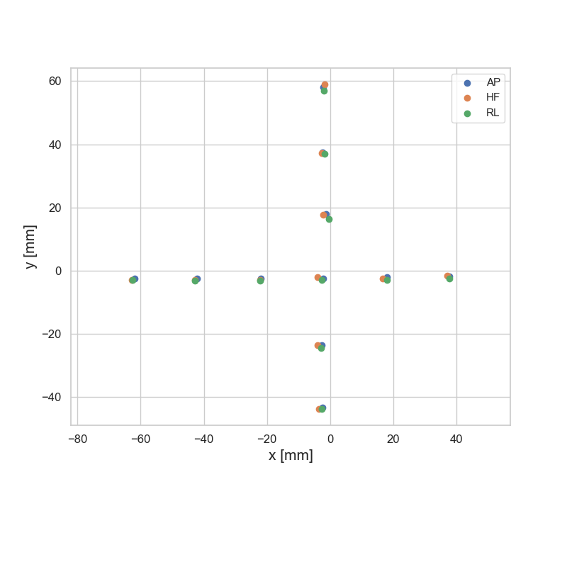
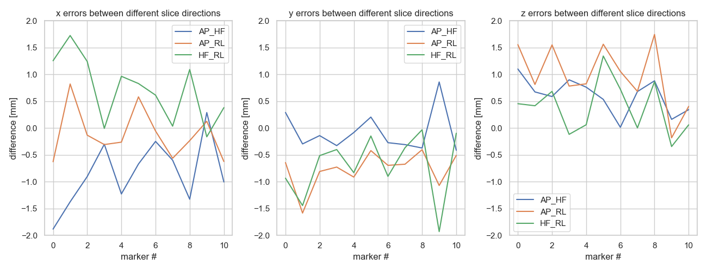

## Marker position stability

Errors in marker position can be a serious issue. This data set can help us get a grip on this, because we have several images of the phantom taken with different slice direction is likely to have the largest errors in marker extraction because the slice thickness is larger than the voxel size in-slice. For this data, the slice thickness is 4.0 mm and the pixel size in slice is 2.6 mm. 

The markers will differ in the different acquisition directions because of the influence of B0, but the markers in the center should be very close to static. The below image show an overlay of the marker images in the three different slice directions:

We can extract the inner 11 markers from a volume like this:

```python
AP_volume.MarkerCentroids = AP_volume.MarkerCentroids[AP_volume.MarkerCentroids.r<100].reset_index(drop=True)
```

We can clearly see that there are indeed some errors in the central markers.:



To quantify these errors, we already have a useful tool; the MatchedMarkerVolume class! The below table shows the **absolute** marker errors between each dataset

| AP / HF      | AP / RL      | HF / RL      |
| ------------ | ------------ | ------------ |
| 2.200722     | 1.796672     | 1.62996      |
| 1.559205     | 2.048565     | 2.288829     |
| 1.087395     | 1.587143     | 1.508799     |
| 1.004159     | 1.111853     | 0.416738     |
| 1.448163     | 1.258656     | 1.275514     |
| 0.881676     | 1.537472     | 1.586933     |
| 0.368377     | 1.440425     | 1.309114     |
| 0.957465     | 1.112788     | 0.367208     |
| 1.63493      | 1.806967     | 1.393177     |
| 0.921969     | 1.09255      | 1.96696      |
| 1.139105     | 0.900554     | 0.397762     |
| **1.2 ±0.5** | **1.4 ±0.3** | **1.3 ±0.6** |

Over all these data sets, we have an average absolute marker extraction error of **1.3  ±0.5**

## If this is our average error, why aren't the errors in the harmonics worse?

When introducing random errors into the marker positions, our analysis shows that errors up to 1 mm are actually quite serious.

However, the stability of the harmonics for this data is good - so what gives?

I think than **random** errors in marker positions are quite bad, but **systemic** errors are actually not going to matter as much. I also think that we are probably dealing more with systemic error than random error here, but let's check.



Looking at this data, we can see that errors do not tend to be entirely random (which would be distributed around 0) but systemic with some random component. 

I don't think we have enough data to get too much fancier than this, but eyeballing, I think we generally have something like:

**systemic error ±0.5 mm**

This  ±0.5 mm is the number we need to be most concerned about.

ALSO. The slice directions for each direction are HF:x AP: z, RL: y.

Therefore, the best estimate of error in each direction should be between the two datasets that aren't slice encoded in that direction:

- in x: AP_RL
- in y: AP_HF
- in z: HF_RL

If you look at these series for each direction, you will see that these do indeed tend to be distributed around 0 ±0.5 (or maybe a bit more)
